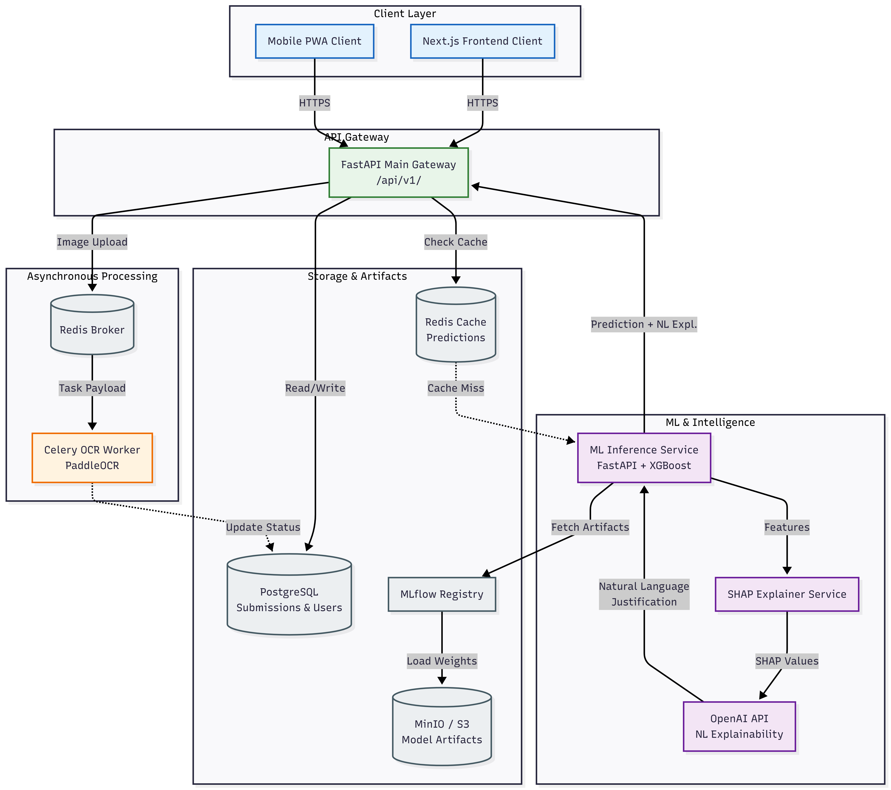
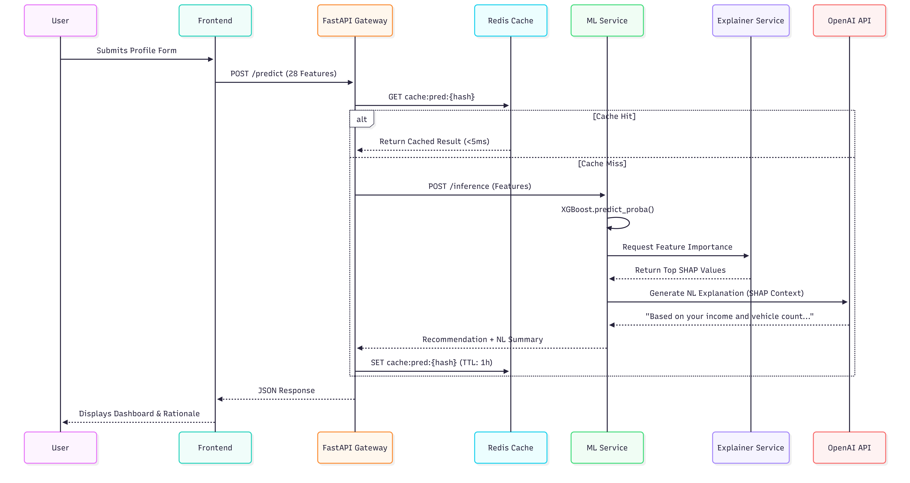

# 🛡️ CERTUS — AI-Powered Insurance Coverage Recommendation Platform

> **Find your ideal insurance bundle in seconds.** Upload your documents or fill a quick form — our AI engine analyzes your profile and recommends the perfect coverage package with a human-readable explanation of why it fits you.



---

## 📋 Table of Contents

- [Product Overview](#-product-overview)
- [System Architecture](#-system-architecture)
- [User Flow](#-user-flow)
- [Tech Stack](#-tech-stack)
- [Coverage Bundles](#-coverage-bundles)
- [ML Pipeline](#-ml-pipeline)
- [Feature Engineering](#-feature-engineering)
- [API Reference](#-api-reference)
- [Services & Ports](#-services--ports)
- [Getting Started](#-getting-started)
- [MLOps & Caching](#-mlops--caching)
- [Project Structure](#-project-structure)

---

## 🎯 Product Overview

**CERTUS** is a mobile-first web application for an international insurance brokerage. It enables clients to receive personalized insurance bundle recommendations through two paths:

| Path              | Description                                                                                |
| ----------------- | ------------------------------------------------------------------------------------------ |
| 📷 **OCR Scan**   | Upload quotes, ID cards, or prior policy documents — extracted automatically via PaddleOCR |
| 📝 **Smart Form** | Fill a structured 5-step form with demographic, financial, and policy details              |

The backend ML engine predicts the best **Coverage Bundle** (out of 10 insurance packages) and provides a natural-language explanation powered by SHAP + LLM.

---

## 🏗️ System Architecture

The system is built as a **modular microservices ecosystem**, decoupling the client-facing interfaces from computationally intensive ML and OCR workloads to ensure high availability and fault tolerance.

```
                   ┌─────────────────────────────────┐
                   │         FRONTEND (Next.js)      │
                   │  ┌───────────┐  ┌─────────────┐ │
                   │  │ Landing / │  │  Dashboard  │ │
                   │  │ QR Page   │  │  Results    │ │
                   │  └─────┬─────┘  └──────┬──────┘ │
                   └────────┼────────────────┼───────┘
                            │   HTTPS/REST   │
                   ┌────────▼────────────────▼───────┐
                   │      API GATEWAY (FastAPI)      │
                   │  /api/v1/ocr    /api/v1/predict │
                   │  /api/v1/form   /api/v1/explain │
                   └──┬──────┬──────────┬─────┬──────┘
                      │      │          │     │
         ┌────────────▼┐  ┌──▼────┐  ┌─▼────┐ │
         │ OCR Service │  │ Redis │  │  ML  │ │
         │ (Worker)    │  │ Cache │  │ Svc  │ │
         └─────────────┘  └───────┘  └──┬───┘ │
                                        │     │
                            ┌───────────▼─┐ ┌─▼───────────┐
                            │  MLflow     │ │  Explainer  │
                            │  Registry   │ │  (SHAP/LLM) │
                            └──────┬──────┘ └─────────────┘
                                   │
                            ┌──────▼──────┐
                            │ PostgreSQL  │
                            │ + MinIO     │
                            │ (artifacts) │
                            └─────────────┘
```

---

## 🔄 User Flow



```
┌─────────────┐     ┌──────────────┐     ┌──────────────────┐     ┌──────────────────┐
│  HOMEPAGE   │────▸│  QR CODE /   │────▸│  DATA CAPTURE    │────▸│   DASHBOARD      │
│  (Landing)  │     │  APP INSTALL │     │  Form OR Scanner │     │  Recommendation  │
│             │     │              │     │                  │     │  + Explanation   │
└─────────────┘     └──────────────┘     └──────────────────┘     └──────────────────┘
```

| Step | Action                                    | Technical Detail                                          |
| ---- | ----------------------------------------- | --------------------------------------------------------- |
| 1    | User lands on homepage                    | Next.js SSR landing page with hero, features, CTA         |
| 2    | Scans QR code or clicks download          | QR encodes deep-link / PWA install prompt                 |
| 3a   | **Option A**: Uploads photos from gallery | Images → Backend → OCR (PaddleOCR) → structured JSON      |
| 3b   | **Option B**: Fills form manually         | React Hook Form → validated JSON payload                  |
| 4    | Backend runs recommendation model         | Feature vector → trained XGBoost → top-K bundles + scores |
| 5    | Dashboard shows results                   | Best bundle card + NLP explanation (SHAP + LLM)           |

---

## 🛠️ Tech Stack

### Frontend

| Technology      | Version | Purpose                 |
| --------------- | ------- | ----------------------- |
| Next.js         | 14      | SSR/SSG React framework |
| Tailwind CSS    | 3.x     | Utility-first styling   |
| shadcn/ui       | latest  | Component library       |
| React Hook Form | 7.x     | Form state management   |

### Backend

| Technology            | Version | Purpose                  |
| --------------------- | ------- | ------------------------ |
| FastAPI               | 0.110+  | API gateway & ML service |
| Python                | 3.11    | Core runtime             |
| XGBoost               | 2.x     | ML inference engine      |
| PaddleOCR / Tesseract | latest  | Document text extraction |
| Celery                | 5.x     | Async task queue         |
| SHAP                  | latest  | Model explainability     |

### Infrastructure

| Technology       | Version | Purpose                              |
| ---------------- | ------- | ------------------------------------ |
| Redis            | 7       | Caching + Celery broker              |
| PostgreSQL       | 16      | Relational storage                   |
| MinIO            | latest  | S3-compatible artifact storage       |
| MLflow           | 2.x     | Experiment tracking & model registry |
| RabbitMQ         | 3.x     | OCR message broker                   |
| Docker / Compose | latest  | Containerization & orchestration     |

---

## 📦 Coverage Bundles

The model predicts one of **10 insurance packages**:

| ID  | Bundle                 | Description                |
| --- | ---------------------- | -------------------------- |
| 0   | `Auto_Comprehensive`   | Full auto coverage         |
| 1   | `Auto_Liability_Basic` | Minimum auto liability     |
| 2   | `Basic_Health`         | Essential health coverage  |
| 3   | `Family_Comprehensive` | Full family package        |
| 4   | `Health_Dental_Vision` | Health + dental + vision   |
| 5   | `Home_Premium`         | Premium homeowner policy   |
| 6   | `Home_Standard`        | Standard homeowner policy  |
| 7   | `Premium_Health_Life`  | Premium health + life      |
| 8   | `Renter_Basic`         | Basic renter's insurance   |
| 9   | `Renter_Premium`       | Premium renter's insurance |

---

## 🤖 ML Pipeline

### Model: XGBoost

XGBoost was selected after robust hyperparameter optimization and AutoML benchmarking, constrained by the competition's evaluation criteria:

- **Memory footprint**: < 10 MB (serialized) — well within the 200 MB penalty threshold
- **Inference latency**: Sub-millisecond per payload via optimized C++ backend
- **Multiclass handling**: Native support for 10-class classification with heterogeneous features

### Explainability: SHAP + LLM

```
XGBoost Prediction
       │
       ▼
  SHAP Values  ──────────▶  OpenAI LLM
  (per feature)              │
                             ▼
                    Natural-language explanation
                    e.g. "Based on your 2 adult
                    dependents and clean claims
                    history (4 years), Family_
                    Comprehensive offers the most
                    complete protection..."
```

### Feature Engineering Highlights

The pipeline synthesizes **40+ derived dimensions** across 11 feature families:

| Family                            | Description                                                                                                   |
| --------------------------------- | ------------------------------------------------------------------------------------------------------------- |
| **Socio-Demographic Profiling**   | Logarithmic income normalization, composite affluence indicators (`Affluent_Family`, `Budget_Renter_Profile`) |
| **Actuarial Risk Quantification** | Composite `Risk_Score` penalizing claims and grace extensions, rewarding claim-free tenure                    |
| **Loyalty Flags**                 | `Churny_Loyalist` — high historical retention with recent attrition signals                                   |
| **Underwriting Friction**         | `Amendment_Rate`, `Quote_Speed` — procedural elasticity metrics                                               |
| **Cyclical Temporal Embeddings**  | Sine/cosine Fourier transforms on Month, Week, Day to preserve cyclicality without categorical explosion      |

All binary thresholds were calibrated via **Mutual Information sweeps** and **Cramér's V optimization**:

| Feature             | Initial     | Optimized  | ΔV     |
| ------------------- | ----------- | ---------- | ------ |
| `Long_Tenure`       | ≥ 36 months | ≥ 5 months | +0.158 |
| `Has_Vehicle`       | > 1         | ≥ 1        | +0.142 |
| `Grace_Period_Ext.` | ≥ 0         | ≥ 1        | +0.130 |
| `High_Friction`     | > 3         | ≥ 1        | +0.072 |

---

## 📡 API Reference

**Base URL**: `http://localhost:8000/api/v1`

| Method | Endpoint   | Description                                      |
| ------ | ---------- | ------------------------------------------------ |
| `POST` | `/predict` | Run ML inference on a structured feature payload |
| `POST` | `/explain` | Generate SHAP + LLM explanation for a prediction |
| `POST` | `/ocr`     | Submit image(s) for async OCR extraction         |
| `POST` | `/form`    | Submit manually-entered form data                |
| `GET`  | `/health`  | Service health check                             |

### Example Request — `/predict`

```json
POST /api/v1/predict
Content-Type: application/json

{
  "Adult_Dependents": 2,
  "Child_Dependents": 1,
  "Infant_Dependents": 0,
  "Estimated_Annual_Income": 85000,
  "Employment_Status": "Full-Time",
  "Region_Code": "R_07",
  "Existing_Policyholder": 1,
  "Previous_Claims_Filed": 0,
  "Years_Without_Claims": 4,
  "Deductible_Tier": "Medium",
  "Payment_Schedule": "Annual",
  "Vehicles_on_Policy": 2,
  ...
}
```

### Example Response

```json
{
  "recommended_bundle": "Family_Comprehensive",
  "bundle_id": 3,
  "confidence": 0.92,
  "top_k": [
    { "bundle": "Family_Comprehensive", "score": 0.92 },
    { "bundle": "Premium_Health_Life", "score": 0.78 },
    { "bundle": "Health_Dental_Vision", "score": 0.65 }
  ],
  "explanation": "Based on your 2 adult and 1 child dependents...",
  "shap_values": {
    "Adult_Dependents": 0.28,
    "Estimated_Annual_Income": 0.22,
    "Child_Dependents": 0.19
  },
  "cached": false,
  "latency_ms": 42
}
```

---

## 🔧 Services & Ports

| Service       | Stack             | Port | Purpose                                |
| ------------- | ----------------- | ---- | -------------------------------------- |
| `frontend`    | Next.js 14        | 3000 | Landing page, form, scanner, dashboard |
| `api-gateway` | FastAPI           | 8000 | Central REST API, auth, routing        |
| `ml-service`  | FastAPI + XGBoost | 8001 | Model inference                        |
| `explainer`   | SHAP + Jinja2     | 8002 | Human-readable explanations            |
| `redis`       | Redis 7           | 6379 | Prediction cache + Celery broker       |
| `postgres`    | PostgreSQL 16     | 5432 | Users, submissions, bundle catalog     |
| `mlflow`      | MLflow 2.x        | 5000 | Experiment tracking, model registry    |
| `minio`       | MinIO             | 9000 | Artifact storage (models, images)      |
| `rabbitmq`    | RabbitMQ 3.x      | 5672 | OCR task queue message broker          |

---

## 🚀 Getting Started

### Prerequisites

- Docker & Docker Compose
- Node.js 18+
- Python 3.11+

### 1. Clone the Repository

```bash
git clone https://github.com/your-org/certus.git
cd certus
```

### 2. Configure Environment

```bash
cp .env.example .env
# Edit .env with your API keys (OpenAI, etc.)
```

### 3. Start All Services

```bash
docker compose up --build
```

### 4. Access the Application

| Interface          | URL                        |
| ------------------ | -------------------------- |
| Frontend           | http://localhost:3000      |
| API Gateway        | http://localhost:8000      |
| API Docs (Swagger) | http://localhost:8000/docs |
| MLflow UI          | http://localhost:5000      |
| MinIO Console      | http://localhost:9001      |
| RabbitMQ Dashboard | http://localhost:15672     |

### 5. Run the Frontend Locally (dev)

```bash
cd frontend
npm install
npm run dev
```

### 6. Run the ML Service Locally (dev)

```bash
cd ml-service
pip install -r requirements.txt
uvicorn main:app --reload --port 8001
```

---

## ⚡ MLOps & Caching

### SHA-256 Cryptographic Cache (Redis)

CERTUS implements an `O(1)` caching layer to eliminate redundant ML inference and guarantee sub-5ms responses for repeated profiles:

```
Incoming Request
      │
      ▼
Sort 28 features deterministically
      │
      ▼
Generate SHA-256 hash of profile
      │
      ├──► Redis HIT? ──► Return cached result (<5ms)
      │
      └──► Redis MISS?
               │
               ▼
         XGBoost Inference
               │
               ▼
         SHAP + LLM Explanation
               │
               ▼
         Write to Redis (async, with TTL)
               │
               ▼
         Return result to client
```

### MLflow Model Registry

- All experiments tracked in MLflow
- Serialized model binaries versioned and stored in MinIO
- Models loaded dynamically at service startup via MLflow artifact URI

### Celery + RabbitMQ (Async OCR)

OCR workloads are offloaded to a Celery worker pool to prevent API gateway bottlenecks:

```bash
# Start OCR workers
celery -A ocr_worker worker --loglevel=info --concurrency=4
```

---

## 📁 Project Structure

```
certus/
├── frontend/                  # Next.js 14 application
│   ├── app/
│   │   ├── page.tsx           # Landing page
│   │   ├── app/scan/          # OCR upload page
│   │   ├── app/form/          # Manual form (5 steps)
│   │   ├── app/dashboard/     # Results & explanation
│   │   └── app/history/       # Submission history
│   └── components/
│
├── api-gateway/               # FastAPI — port 8000
│   ├── main.py
│   ├── routers/
│   └── cache/                 # Redis SHA-256 layer
│
├── ml-service/                # FastAPI — port 8001
│   ├── model/
│   │   ├── xgboost_model.py
│   │   └── feature_pipeline.py
│   └── mlflow_registry.py
│
├── explainer/                 # SHAP + LLM — port 8002
│   ├── shap_explainer.py
│   └── llm_narrator.py
│
├── ocr-worker/                # Celery + PaddleOCR
│   ├── tasks.py
│   └── paddle_ocr.py
│
├── docker-compose.yml
├── .env.example
└── README.md
```

---

## 📊 Dataset Features (29 columns)

<details>
<summary>Click to expand full feature reference</summary>

| Column                            | Type        | Description                            |
| --------------------------------- | ----------- | -------------------------------------- |
| `User_ID`                         | string      | Unique customer identifier             |
| `Adult_Dependents`                | int         | Number of adult dependents             |
| `Child_Dependents`                | int         | Number of child dependents             |
| `Infant_Dependents`               | int         | Number of infant dependents            |
| `Estimated_Annual_Income`         | float       | Yearly household income                |
| `Employment_Status`               | categorical | Primary applicant's employment type    |
| `Region_Code`                     | categorical | Anonymized geographic region           |
| `Existing_Policyholder`           | bool        | Has active policy with company         |
| `Previous_Claims_Filed`           | int         | Total prior claims                     |
| `Years_Without_Claims`            | int         | Consecutive claim-free years           |
| `Previous_Policy_Duration_Months` | int         | Duration of prior policy               |
| `Policy_Cancelled_Post_Purchase`  | bool        | History of post-purchase cancellations |
| `Deductible_Tier`                 | categorical | Out-of-pocket deductible level         |
| `Payment_Schedule`                | categorical | Premium payment frequency              |
| `Vehicles_on_Policy`              | int         | Number of vehicles covered             |
| `Custom_Riders_Requested`         | int         | Special add-ons requested              |
| `Grace_Period_Extensions`         | int         | Payment deadline extensions used       |
| `Days_Since_Quote`                | int         | Days from quote to finalization        |
| `Underwriting_Processing_Days`    | int         | Underwriting approval duration         |
| `Policy_Amendments_Count`         | int         | Quote modifications before signing     |
| `Acquisition_Channel`             | categorical | How the policy was sold                |
| `Broker_Agency_Type`              | categorical | Scale of brokerage firm                |
| `Broker_ID`                       | categorical | Sales agent identifier                 |
| `Employer_ID`                     | categorical | Customer's employer identifier         |
| `Policy_Start_Year`               | int         | Coverage start year                    |
| `Policy_Start_Month`              | int         | Coverage start month                   |
| `Policy_Start_Week`               | int         | Coverage start week of year            |
| `Policy_Start_Day`                | int         | Coverage start day of month            |

</details>

---

## 📜 License

MIT License — see [LICENSE](LICENSE) for details.

---

<div align="center">
  <strong>CERTUS</strong> · DataQuest Hackathon Phase II · Built with ❤️ by Team DATA-DANGEREUSE
</div>
